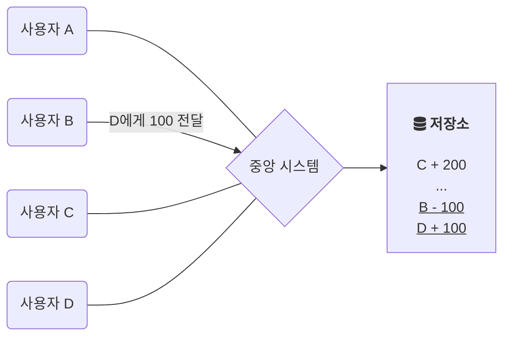
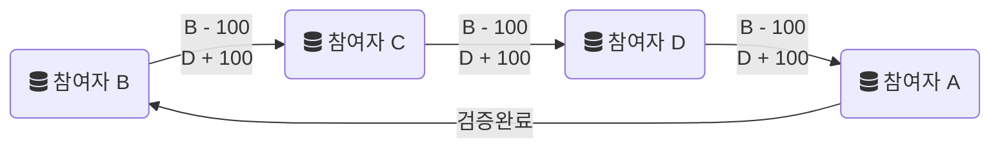
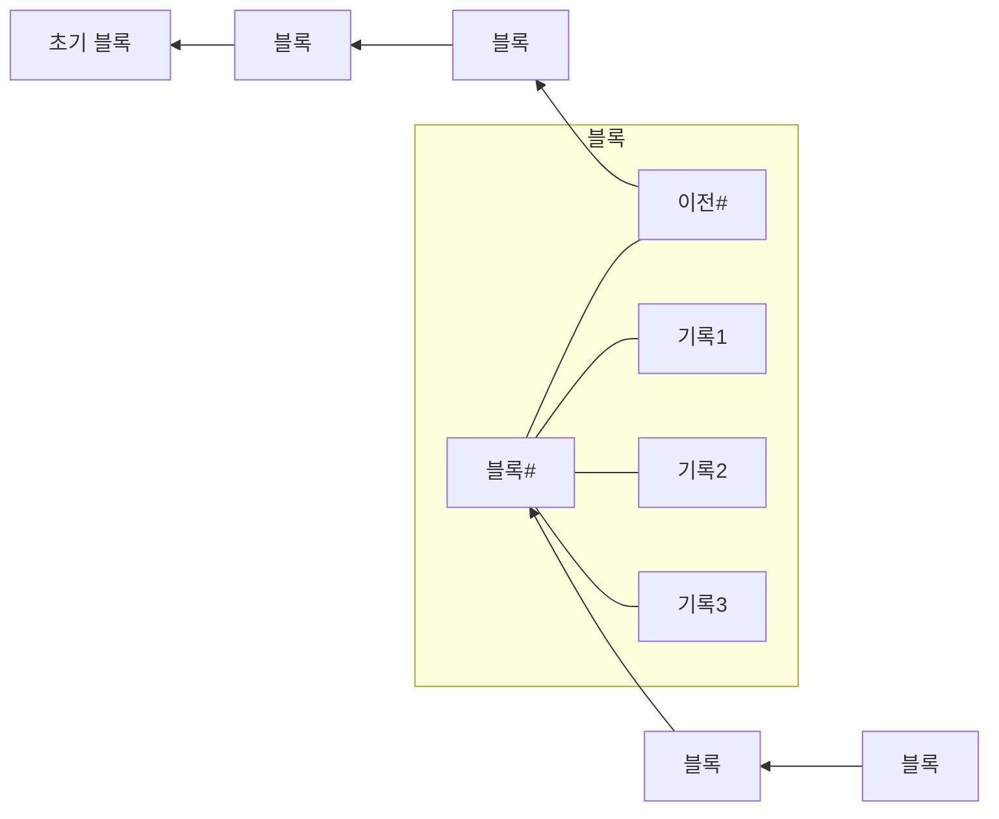
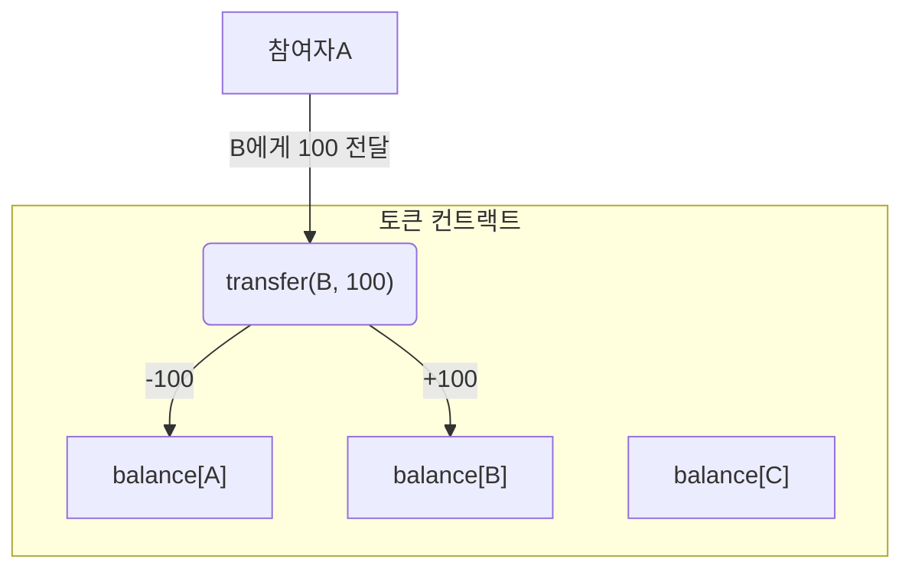
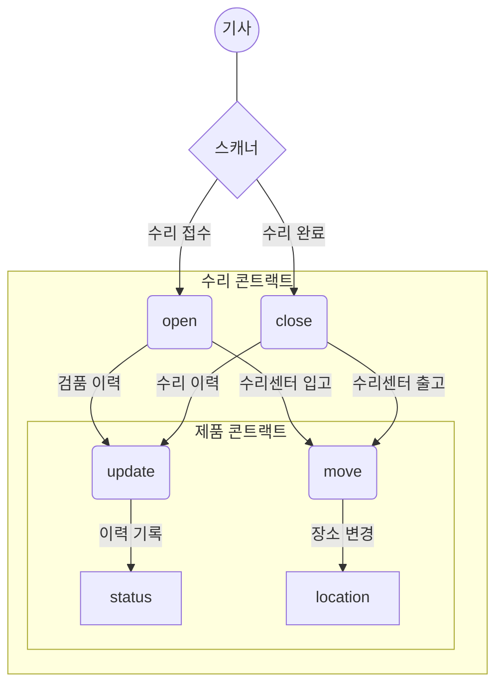
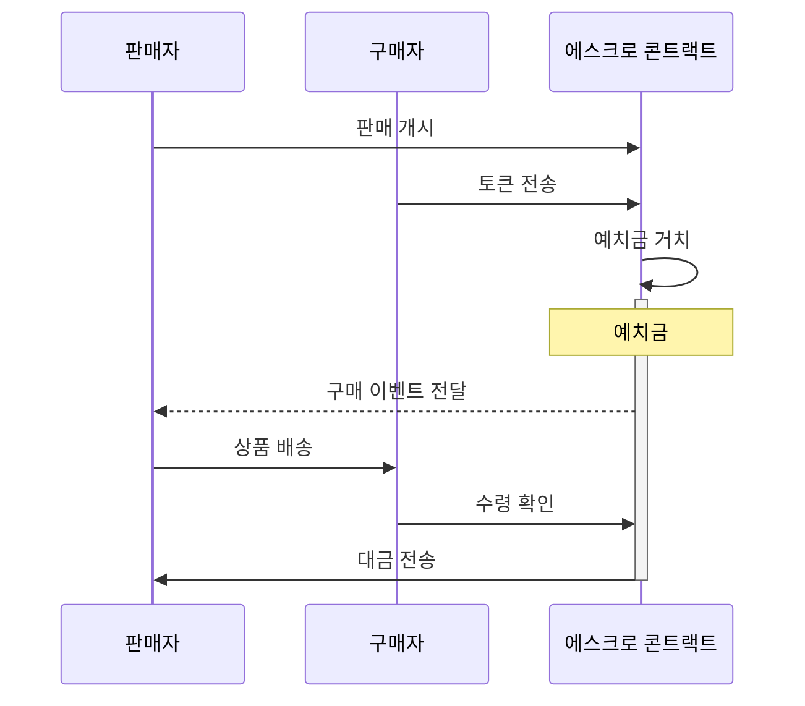

# 블록체인 적정기술

제품과 거래의 신뢰성은 애프터마켓에서 가장 중요한 성질입니다. 《리본(REBORN)》 플랫폼은 블록체인을 적용하여 거래와 수리 기록을 블록체인에 저장하여 무결성을 보장합니다. 이용자는 플랫폼을 사용하는 것만으로 안전하게 거래 할 수 있습니다.

## 블록체인 개요

블록체인은 업무 기록(`transaction`)을 블록이라는 데이터 단위에 저장하여 참여자들에게 공유하고 교차 검증하는 기술입니다. 따라서 참여자는 모든 업무 기록을 보유하게 됩니다. 공유된 각 블록은 서로 연결되어서, 한번 검증하여 합의된 내용은 누구도 수정할 수 없는 구조로 되어 있습니다. 이 시스템은 데이터의 손실을 방지하고 무결성이 보증되어 신뢰할 수 없던 기존 중앙 집중식 시스템보다 진보한 형태입니다. 참여자는 마이닝이라는 거래 검증 과정에서 많은 연산을 하게 되어 블록체인 네트워크는 참여자에게 코인이라는 형태로 보상을 제공합니다.

### 중앙 집중식 구조

데이터를 관장하는 중앙 시스템 혹은 저장소만 공격당해도 모든 사용자가 영향을 받는다. 저장소의 모든 내용이 사용자에게 공개되지 않기에 신뢰성이 없다.

### 블록체인 구조

참여자는 모든 기록을 보유하고 교차 검증합니다. 공격자는 과반 참여자들의 데이터를 동시에 변조하여야 합니다.

### 블록의 무결성 검증

각 블록은 새로운 기록들과 이전 블록의 내용을 참조하여 해시로 저장합니다. 이 해시(`KECCAK-256`)는 암호화 함수를 사용하여 원본 내용이 조금만 바뀌어도 완전 다른 결과가 생성됩니다. 따라서 공격자는 변조하는 블록부터 모든 블록의 암호를 차례대로 다시 계산하여야 합니다.

## 이더리움 개요

비트코인과 같은 1세대 블록체인은 거래를 기록하는 단순 화폐의 역할만 하였습니다. 이더리움은 블록체인이 더 많은 업무를 수행 할 수 있도록 스마트 콘트랙트(Smart Contract)라는 프로그램을 작성할 수 있도록 하였습니다. 각 업무가 작동되는 방식을 정의한 이 스마트 콘트랙트의 조합으로 DApp(Decentralized Application)을 만들 수 있게 되어 블록체인의 가능성은 무한히 확장되었습니다. 서비스에서 사용되는 토큰부터 신분 증명, 의결 업무 등 이더리움의 스마트 콘트랙트의 활용성은 무궁무진합니다.

### 토큰 스마트 컨트랙트의 예

블록체인의 토큰 또한 하나의 스마트 컨트랙트로 정의 할 수 있다. 참여자마다 부여되는 주소(`address`)마다 값(`balance`)을 저장하고 전달(`transfer`) 함수로 참여자들은 값을 이동시킬 수 있다. 이때 각 함수 요청(`transaction`)을 블록에 기록 한다.

## 리본 플랫폼과 이더리움

애프터마켓의 신뢰성을 위해 리본 플랫폼은 다양한 업무에서 이더리움 블록체인을 활용합니다. 각 업무는 블록에 기록되어 투명하게 공개되고 사용자는 언제든지 유통, 수리 이력 같은 과거 내용을 확인 할 수 있습니다.

### 수리 이력 관리의 예

제품의 수리 이력은 거래 가격을 결정하는 중요 항목 하나입니다. 리본 플랫폼은 제품을 입·출고 할 때 자동으로 블록체인에 이력을 기록 합니다.

### 에스크로 거래의 예

이더리움에서 스마트 콘트랙트는 토큰을 보유 할 수 있는 주소를 가지고 있습니다. 중계자 없이 안전한 에스크로 중고거래를 가능하게 합니다.

